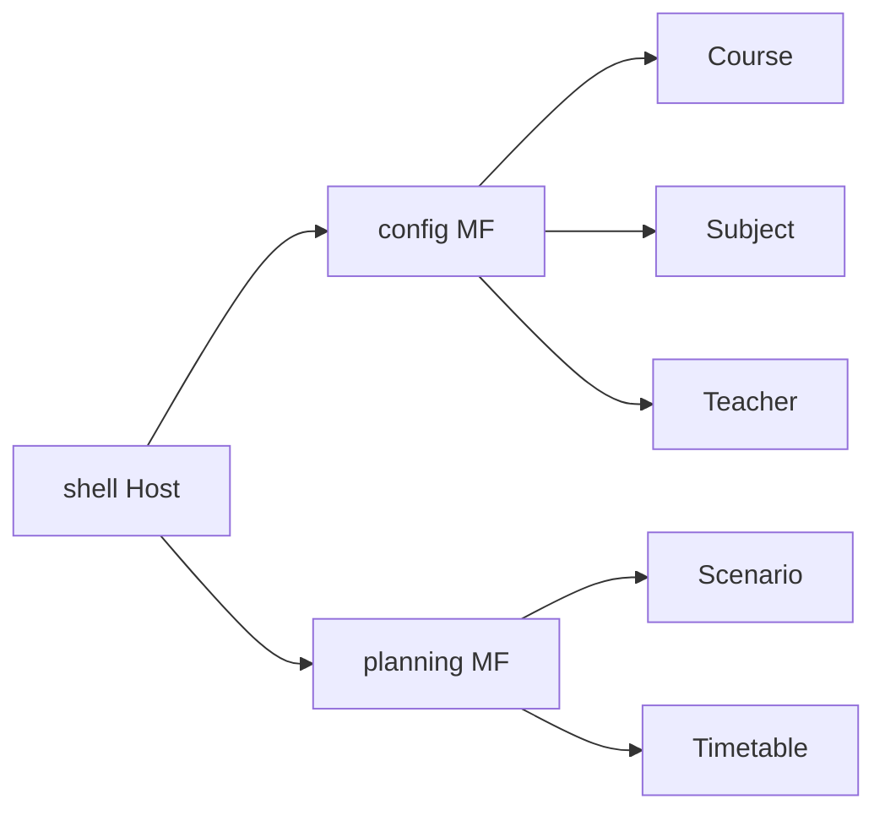
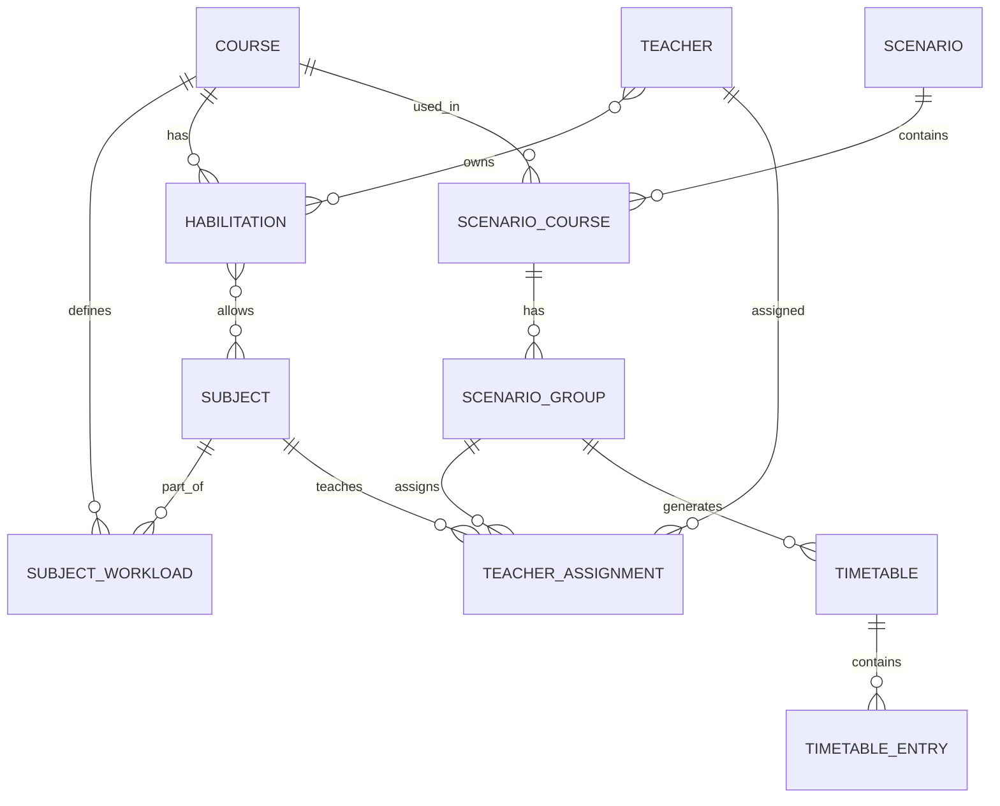

# 📦 School organizer Monorepo NX: Angular + NestJS + FastAPI

Este proyecto es un sistema integral para la generación de horarios escolares, diseñado para organizar automáticamente clases de un colegio en base a profesores, cursos, grupos y asignaturas. Utiliza un monorepo NX para gestionar de manera eficiente múltiples aplicaciones y librerías compartidas dentro de un mismo repositorio.

La arquitectura combina varios componentes clave:

Backend principal: desarrollado con NestJS, encargado de la gestión de usuarios, datos académicos y exposición de APIs para el frontend.

Frontend: construido con Angular y basado en Micro Frontends (MF), lo que permite desarrollar, desplegar y escalar módulos de forma independiente.

Cálculos de optimización de horarios: implementados en Python utilizando OR-Tools, y expuestos mediante una API en FastAPI, encargada de generar horarios válidos cumpliendo todas las restricciones de profesores, cursos, grupos y asignaturas.

El objetivo de este proyecto es ofrecer una solución automatizada y escalable para la planificación de horarios escolares, reduciendo el tiempo y esfuerzo necesarios en comparación con métodos manuales.

La demo del proyecto se encuentra desplegada en https://school-organizer-shell-jmhq.onrender.com/ Es necesario esperar a que la instancia de los servicios se levante por lo que tardará unos minutos en estar disponible

A continuación, se detallan los apartados específicos del Frontend, Backend NestJS, y API de FastAPI, incluyendo su estructura, configuración y flujo de trabajo.

# 🎨 Front end
Este proyecto está construido con **Angular** dentro de un **monorepo Nx** y sigue una arquitectura basada en **Micro Frontends (MF)** utilizando **Webpack Module Federation**.

La solución está organizada mediante **división vertical por dominios**, donde cada Micro Frontend representa un dominio de negocio independiente.

---

## 🏗️ Arquitectura General

La plataforma está compuesta por:

- 🏠 `shell` → Host Application (contenedor principal)
- ⚙️ `config` → Micro Frontend - Dominio de Configuración
- 📅 `planning` → Micro Frontend - Dominio de Planificación

### 📐 Enfoque Arquitectónico

- Monorepo gestionado con **Nx**
- Micro Frontends implementados con **Module Federation**
- División vertical por dominios
- Independencia funcional entre dominios
- Sin comunicación directa entre MF (actualmente)
- Cada dominio encapsula su lógica, rutas y features

---

## 🧭 Diagrama Arquitectónico (Necesario Mermaid instalado)



---

## 🗂️ Estructura del Workspace

```
apps/
│
├── shell/
├── config/
└── planning/

libs/
└── (shared libraries si aplica)
```

- `apps/` contiene las aplicaciones (Host + Micro Frontends).
- `libs/` puede contener librerías compartidas (UI, utilidades, modelos, etc.).
- Cada dominio mantiene sus propias features organizadas de forma interna.

---

## 🏠 Shell (Host)

La aplicación `shell` es responsable de:

- Orquestar la carga de los Micro Frontends
- Definir el layout global (navbar, sidebar, etc.)
- Gestionar el routing principal
- Configurar Module Federation
- Compartir dependencias comunes

El Shell **no contiene lógica de negocio de dominio**.

---

## ⚙️ Micro Frontend: Config

Dominio encargado de la **configuración académica**.

### 🎯 Responsabilidad

Centraliza la gestión de entidades base del sistema.

### 📂 Features

#### 📘 course-management-feature
Gestión de cursos:
- Crear curso
- Editar curso
- Eliminar curso
- Listar cursos

#### 📗 subject-management-feature
Gestión de asignaturas:
- Alta de asignaturas
- Edición
- Eliminación
- Asociación a cursos

#### 👨‍🏫 teacher-management-feature
Gestión de docentes:
- Registro
- Edición
- Eliminación
- Asociación a asignaturas o cursos

---

## 📅 Micro Frontend: Planning

Dominio encargado de la **planificación académica**.

### 🎯 Responsabilidad

Gestiona escenarios y planificación horaria.

### 📂 Features

#### 🧩 scenario-management-feature
- Creación de escenarios
- Configuración de parámetros
- Gestión de versiones (si aplica)

#### 🗓️ scenario-timetable-feature
- Generación de horarios
- Visualización de planificación
- Edición manual
- Validación de conflictos

---

## 🔗 Comunicación entre Micro Frontends

Estado actual:

- ❌ No existe comunicación directa entre MF.
- ❌ No se comparten estados entre dominios.
- ✅ Cada dominio es completamente independiente.
- ✅ El único punto de integración es el Shell.

Esto permite mantener bajo acoplamiento y alta cohesión por dominio.

---

## 🧩 Module Federation

Cada Micro Frontend:

- Expone sus módulos mediante `Module Federation`.
- Es cargado dinámicamente por el `shell`.
- Puede evolucionar y desplegarse de forma independiente (si se configura CI/CD separado).

Las dependencias compartidas (Angular, RxJS, etc.) se definen como `shared` en la configuración de Module Federation.

---

## 🚀 Instalación

```bash
npm install
```

---

## ▶️ Desarrollo

### Ejecutar Shell

```bash
nx serve shell
```

### Ejecutar Config MF

```bash
nx serve config
```

### Ejecutar Planning MF

```bash
nx serve planning
```

---

## 🧪 Build

### Build Shell

```bash
nx build shell
```

### Build Config

```bash
nx build config
```

### Build Planning

```bash
nx build planning
```

## 🚀 Despliegue
TBD: Pendiente de definir las variables de despliegue utilizadas.

---

## 🧱 Principios de Diseño

- Arquitectura orientada a dominio (DDD-inspired)
- División vertical
- Bajo acoplamiento entre dominios
- Alta cohesión interna por feature
- Feature-based structure dentro de cada MF
- Escalabilidad organizacional (equipos por dominio)

---

## 📈 Escalabilidad

Esta arquitectura permite:

- Agregar nuevos dominios como nuevos MF
- Escalar equipos por dominio
- Evolucionar funcionalidades de forma aislada
- Mantener límites claros de responsabilidad

---

## 🛠️ Stack Tecnológico

- Angular
- Nx
- Webpack Module Federation
- TypeScript
- RxJS
- Angular Router

---

### 📌 Estado Actual

- ✅ Arquitectura MF implementada
- ✅ División vertical por dominios
- ✅ Module Federation configurado
- ❌ Comunicación entre dominios (pendiente si se requiere)

### 📝 Pendiente de implementar (Arquitectura)
- Extender Unit test a todo el proyecto
- Revisar test de integración Playwright desactualizados para que prueben el flujo completo de la aplicación
- Revisar linter para establecer boundaries entre los diferentes dominios y evitar el acoplamiento entre features (una feature no debería poder importar de otra)
- Refactorizar la lógica de negocio extrayendo la misma a Use Cases independientes del framework (Clean Architecture)

### 🔜 Pendiente de implementar (Funcionalidad)
- Implementar cambios manuales en horarios y recálculo
- Implementar publicación de la planificación en rango de fechar
- Implementar el domino de daily-management, que permitirá hacer cambios diarios sobre la planificación
- Implementar login y multitenant.

# 📘 Backend

## 🔹 Índice

1. [Visión general](#visión-general)  
2. [Modelo de datos](#modelo-de-datos)  
3. [Diagrama ER](#diagrama-er)  
4. [Rutas de API](#rutas-de-api)  
5. [Ejemplos de payload](#ejemplos-de-payload)  

---

## 🔹 Visión general

Esta API permite gestionar:

- **Cursos (`Course`)** y **materias (`Subject`)**  
- **Habilitaciones de profesores (`Habilitation`)**  
- **Profesores (`Teacher`)**  
- **Escenarios académicos (`Scenario`)**  
- **Horarios (`Timetable`)** calculados automáticamente  

Objetivos principales:

- Gestión CRUD de todas las entidades  
- Consultas paginadas  
- Relación flexible entre cursos, materias y profesores  
- Generación y cálculo de horarios por escenario  

---

## 🔹 Modelo de datos

### Entidades principales

| Entidad | Descripción | Relaciones principales |
|---------|------------|----------------------|
| **Course** | Curso académico | Tiene `SubjectWorkload` |
| **Subject** | Materia | Asociada a `Course` vía `SubjectWorkload` |
| **SubjectWorkload** | Horas y carga de materia | `Course` ↔ `Subject` |
| **Habilitation** | Permisos de un profesor sobre curso/materia | `Teacher` ↔ `Course` ↔ `Subject` |
| **Teacher** | Profesor | Tiene varias `Habilitation` |
| **Scenario** | Escenario académico | Contiene `ScenarioCourse`, `ScenarioGroup` y `TeacherAssignment` |
| **ScenarioCourse** | Curso dentro de un escenario | Relaciona `Scenario` ↔ `Course` |
| **ScenarioGroup** | Grupo dentro de curso en escenario | Contiene `TeacherAssignment` |
| **TeacherAssignment** | Asignación de profesor a materia | Relaciona `Teacher` ↔ `Subject` ↔ `ScenarioGroup` |
| **Timetable** | Horario generado por escenario | Contiene `TimetableEntry` |
| **TimetableEntry** | Entrada de horario (día/hora) | Relaciona `Subject` ↔ `Teacher` ↔ `ScenarioGroup` |

---

## 🔹 Diagrama ER



## 🔹 Rutas de API

### Course
| Método | Ruta | Descripción |
|--------|------|------------|
| GET    | /course | Lista paginada |
| POST   | /course | Crear curso |
| GET    | /course/{id} | Obtener por id |
| PUT    | /course/{id} | Actualizar curso |
| DELETE | /course/{id} | Eliminar curso |

### Habilitation
| Método | Ruta | Descripción |
|--------|------|------------|
| GET    | /habilitation | Lista paginada |
| POST   | /habilitation | Crear habilitación |
| GET    | /habilitation/{id} | Obtener por id |
| PUT    | /habilitation/{id} | Actualizar |
| DELETE | /habilitation/{id} | Eliminar |

### Teacher
| Método | Ruta | Descripción |
|--------|------|------------|
| GET    | /teacher | Lista paginada |
| POST   | /teacher | Crear |
| GET    | /teacher/{id} | Obtener por id |
| PUT    | /teacher/{id} | Actualizar |
| DELETE | /teacher/{id} | Eliminar |

### Scenario
| Método | Ruta | Descripción |
|--------|------|------------|
| GET    | /scenario | Lista paginada |
| POST   | /scenario | Crear |
| GET    | /scenario/{id} | Obtener por id |
| PUT    | /scenario/{id} | Actualizar |
| DELETE | /scenario/{id} | Eliminar |
| GET    | /scenario/{id}/timetable | Obtener horario |
| GET    | /scenario/{id}/calculate | Calcular horario |

### Subject
| Método | Ruta | Descripción |
|--------|------|------------|
| GET    | /subject | Lista paginada |
| POST   | /subject | Crear |
| GET    | /subject/{id} | Obtener por id |
| PUT    | /subject/{id} | Actualizar |
| DELETE | /subject/{id} | Eliminar |

---

## 🔹 Ejemplos de payload JSON

### Crear Course
```json
{
  "name": "Curso 1",
  "subjectWorkLoads": [
    {
      "subject": {"id": 1, "name": "Matemáticas"},
      "workload": {"hoursPerWeek": 10, "maxDailyWorkload": 2}
    }
  ]
}
```
### Crear Habilitación
```json
{
  "name": "Habilitación Matemáticas",
  "course": 1,
  "subjects": [
    {"id": 1, "name": "Matemáticas"},
    {"id": 2, "name": "Historia"}
  ]
}
```
### Crear Escenario
```json
{
  "name": "Escenario Primavera 2024",
  "courses": [
    {
      "courseId": 1,
      "groups": [
        {
          "groupName": "Grupo A",
          "teacherAssignments": [
            {"teacherId": 1, "subjectId": 1}
          ]
        }
      ]
    }
  ]
}
```
### Crear Asignatura
```json
{
  "name": "Matemáticas"
}
```
### Get Horario (de escenario)
```json
[
  {
    "courseId": 1,
    "course": {"id": 1},
    "group": {
      "id": 1,
      "groupName": "Grupo A",
      "teacherAssignments": [
        {
          "teacher": {"id": 1, "name": "Juan Pérez"},
          "subject": {"id": 1, "name": "Matemáticas", "hoursPerWeek": 10, "maxDailyWorkload": 2}
        }
      ]
    },
    "groupId": 1,
    "hours": [
      [
        {"day": 1, "hour": 1, "subjectId": 1, "teacherId": 1},
        {"day": 1, "hour": 2, "subjectId": 1, "teacherId": 1}
      ]
    ]
  }
]
```
